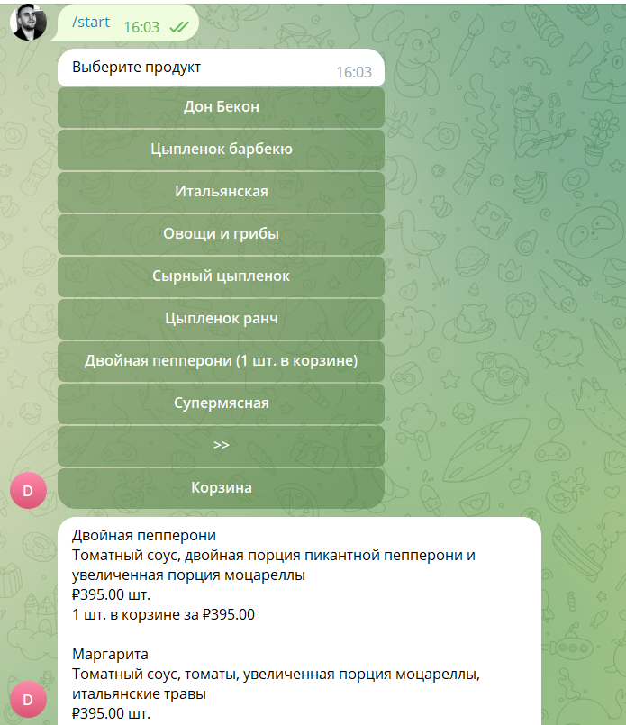
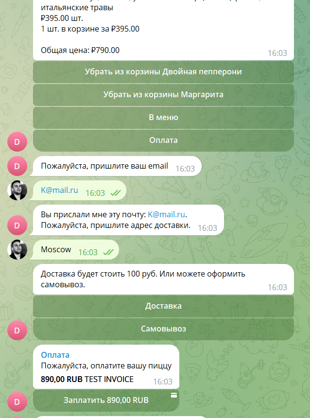

# Telegram Pizza Bot

### Overview

MVP of telegram shop with:

- menu
- product descriptions
- cart
- payment
- geo
- notifications (deliveryman and client)




### How to install

You need to create `.env` file and write next parameters in file:

`TG_BOT_TOKEN` - secret telegram bot token. Use [this](https://core.telegram.org/bots#creating-a-new-bot) instruction (
use VPN to open this link in Russia).

After you got `TG_BOT_TOKEN` you need to write to you telegram bot any message (`/start` for example).

`MOTLIN_CLIENT_ID` - ID of your shop in [elasticpath](https://euwest.cm.elasticpath.com/application-keys#legacy-key)

`MOTLIN_CLIENT_SECRET` - Secret token of your shop
in [elasticpath](https://euwest.cm.elasticpath.com/application-keys#legacy-key)

`REDIS_DB_ADDRESS` - register your [redis](https://redislabs.com/) account and get address of your database (for
example `redis-13965.f18.us-east-4-9.wc1.cloud.redislabs.com`).

`REDIS_DB_PORT` - usually port writes in db address in the
end `redis-13965.f18.us-east-4-9.wc1.cloud.redislabs.com:16635`

`REDIS_DB_PASSWORD` - redis also will generate your DB password when your will init DB.

`YANDEX_GEO_APIKEY` - [service](https://yandex.ru/dev/maps/geocoder/) API key for getting coordinates by address (
customer and pizzeria).

`BANK_TOKEN` - token for integration with payments via telegram. You can get it from @BotFather

`TEST_TELEGRAM_CHAT_ID` - Optional. Id of the chat where delivery messages can be sent.
You can leave it blank, but in this case you must add this to the pizzeria data when uploading (may be different for
each pizzeria).

`CUSTOMER_ADDRESSES_FLOW_SLUG` and `PIZZERIA_ADDRESSES_FLOW_SLUG` - Optional. Slugs of moltin models.
You can leave it blank if you chose the default, but you must also change it in `customer_address_flow_data.json`
and `pizzeria_address_flow_data.json`.
You will need to change `address_flow -> data -> slug` for both files.

`PIZZERIA_ADDRESSES_DELIVERYMAN_TELEGRAM_CHAT_ID`, `PIZZERIA_ADDRESSES_ADDRESS`, `CUSTOMER_ADDRESSES_CUSTOMER_ID_SLUG`
, `CUSTOMER_ADDRESSES_LONGITUDE_SLUG`, `CUSTOMER_ADDRESSES_LATITUDE_SLUG` - Optional. Slugs for model fields.
You can leave it blank, but if you want to fill it in manually, you must also change these slugs in
the `customer_address_flow_data.json` and `pizzeria_address_flow_data.json` files.
This data is stored in `address_fields -> slug` for each field.

`PRODUCTS_ON_PAGE` - Optional. By default, maximum 8 products (pizza) per page in telegram.

`PROXY` - proxy IP with port and https if you need. Work with empty proxy if you in Europe.

Python3 should be already installed.
Then use `pip` (or `pip3`, if there is a conflict with Python2) to install dependencies:

```
pip install -r requirements.txt
```

Then optional run script `load_init_data.py` to load some init data and create models in moltin:

```
python load_init_data.py
```

### How to use

Open command line (in windows `Win+R` and write `cmd` and `Ok`). Go to directory with program or write in cmd:

```
python tg_bot.py 
```

### References

- [telegram bots documentation](https://core.telegram.org/bots#creating-a-new-bot)
- [heroku](https://heroku.com)
- [redis](https://redislabs.com/)
- [elasticpath](https://www.elasticpath.com/)
- [yandex geocoder](https://yandex.ru/dev/maps/geocoder/)

### Project Goals

The code is written for educational purposes on online-course for web-developers [dvmn.org](https://dvmn.org/).
